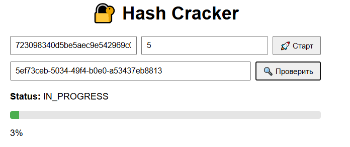
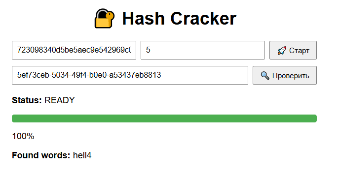

# Crack Hash System

**Distributed system for cracking MD5 hashes with fault tolerance**

# Functional

---


## Quickstart

### Requirements
- React JS

### Clone repository
```bash
git clone https://github.com/vitalioo/ris-fault-tolerance-front.git

npm start